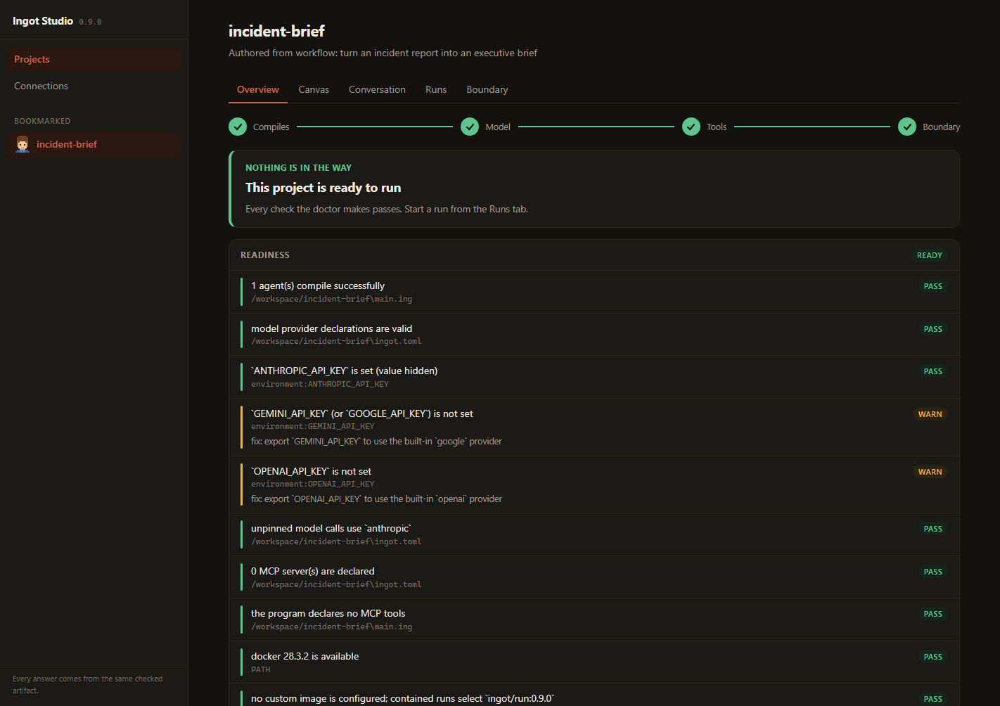
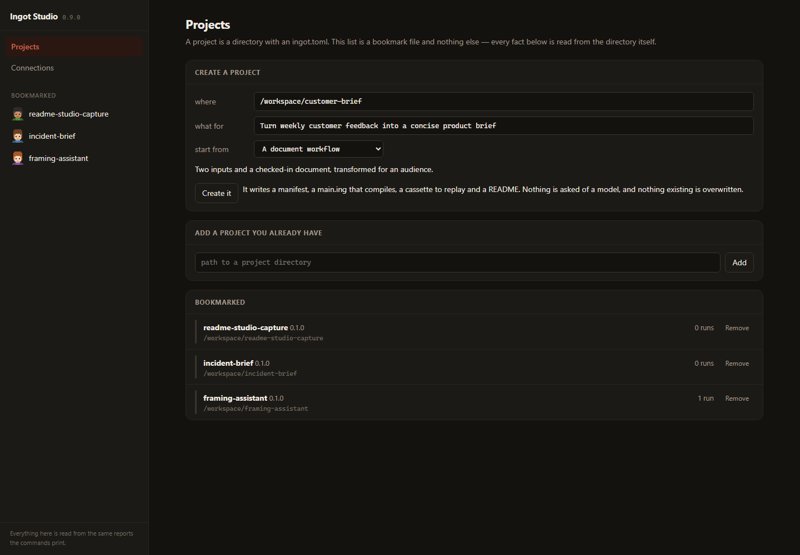
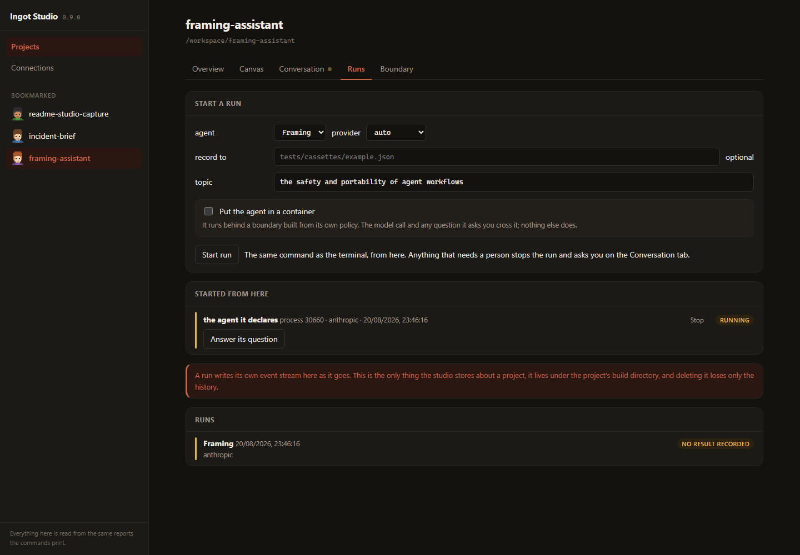
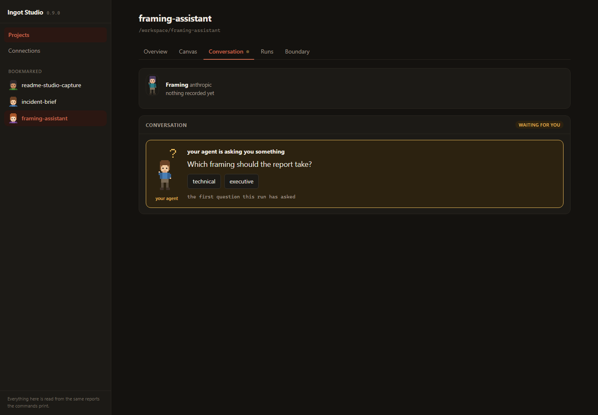

<div align="center">

<picture>
  <source media="(prefers-color-scheme: dark)" srcset="./docs/assets/branding/ingot-lang-dark.png">
  <source media="(prefers-color-scheme: light)" srcset="./docs/assets/branding/ingot-lang-light.png">
  
</picture>

# Ingot

### A compiler and toolchain for agents that have to keep their promises

**Open source, portable and default-deny.** Ingot turns a small declarative
language into a checked artifact: what an agent may reach, what it can cost at
most, and what it must produce.

<p>
  <em>Rust · Agent IR · MCP · OCI · replayable cassettes · policy-derived containers</em>
</p>

<p>
  <a href="https://github.com/mathissdupont/ingot/actions/workflows/ci.yml"></a>
  <a href="https://github.com/mathissdupont/ingot/releases"></a>
  <a href="./LICENSE"></a>
  
  
</p>

<br>



</div>

---

> [!NOTE]
> **An agent does not get permissions because it asked.** Ingot checks types,
> effects, policy and budgets before a run, enforces the policy at the container
> boundary, and records the run so it can be replayed without a model key.

## Contents

- [What it is](#what-it-is)
- [Studio](#studio)
- [Start in thirty seconds](#start-in-thirty-seconds)
- [Why a small language](#deliberately-not-a-general-purpose-language)
- [A person in the loop](#a-person-in-the-loop-without-losing-the-run)
- [Example](#an-example)
- [Install](#install)
- [Commands](#commands)
- [Architecture](#how-it-fits-together)
- [Documentation and specifications](#documentation)
- [Roadmap and known gaps](#roadmap)

## What it is

Ingot compiles a small declarative language to **Agent IR**: a portable artifact
that states what an agent may reach, what it will cost at most, and what it
produces. It is a compiler and a toolchain, not an agent framework.

- **Checked before it runs.** Types, effects, policy, budgets and outputs are
  compiler errors rather than conventions in a prompt.
- **Enforced while it runs.** A policy can become a real container boundary with
  a filtering proxy and no unlisted route out.
- **Replayable after it runs.** Model answers, tool results and human decisions
  are recorded in cassettes for offline, keyless tests.

The point is what it refuses:

```text
$ ingot check
error[ING4007]: `web.search` requires the `network` effect, which no policy rule grants
  --> main.ing:31:12
   |
31 |     hits = call web.search(topic)
   |            ^^^^^^^^^^^^^^^^^^^^^^ needs `network`
   |
   = note: Ingot is default-deny: an effect with no rule is denied
   = help: add `network allow [...]` to the agent's `policy` block
```

That is not a lint. `network allow ["arxiv.org"]` is checked against every call
at compile time — and then **enforced at run time**, by a filtering proxy on a
container network with no other route out. A tool server that ignores the proxy
reaches nothing, rather than reaching everything.

## Studio

Studio is the browser surface for the same compiler and runtime. Create or add
a project, inspect its checked artifact, start and record runs, and answer the
questions an agent deliberately puts to a person.

### Create a project

Choose a starter and describe the workflow. Studio writes a compiling project,
a replayable cassette and its local README without calling a model.



### Start and follow runs

Select the agent and provider, supply typed inputs, optionally record a cassette
or enable a policy-derived container, then follow the event stream as it runs.



### Keep a person in the loop

When a program uses `consult`, the run pauses at the exact question. Studio
shows its context and permitted answers, then records the human response beside
the rest of the run.



## Start in thirty seconds

```bash
curl -fsSL https://raw.githubusercontent.com/mathissdupont/ingot/main/scripts/install.sh | sh
# Windows: irm https://.../scripts/install.ps1 | iex   ·   full details under Install

ingot init hello && cd hello
ingot check                                                  # types, effects, policy, budgets
ingot run --provider replay --input topic="compiler design"  # prints a real artifact
```

Thirty seconds is the installed binary. `cargo install ingot-cli` also works and
compiles twenty-one crates on your machine first, which is the reason the line
above exists.

A new project ships with a recorded fixture, so that last command produces an
answer without contacting anything. Point it at a live model when you want one:

```bash
export ANTHROPIC_API_KEY=…          # or OPENAI_API_KEY, or GEMINI_API_KEY
ingot run --input topic="compiler design"
```

And `ingot studio` puts the whole thing on one page: create or open projects,
inspect what compiles and what each agent may reach, start and record runs,
answer questions, and build the boundary image without leaving the page.

> [!IMPORTANT]
> **The container boundary needs this repository, not just the binary.** Ingot
> never downloads an image — signing it needs a trust root, and one is not
> invented here ([GAP-029](docs/gaps.md#gap-029)). `ingot image build` therefore
> wants an Ingot checkout at the same version, so `--contained` is available to
> somebody who cloned this and not to somebody who only installed it. Everything
> else on this page works either way.

## Deliberately not a general-purpose language

Ingot has no unbounded loops and no recursion between agents. That is the
feature rather than a gap waiting to be filled.

`budget { steps <= 4 }` is checked when you compile, and it can only be checked
because the flow has a statically bounded shape. Add `while` and "how many model
calls can this make?" stops being answerable — so the budget stops being a
promise and becomes a hope. The same trade buys the rest: every capability is
declared and matched against a policy because there are few enough routes to the
outside world to name them all.

Things the compiler catches before anything runs:

- a tool called with the wrong argument type, or with one missing
- a capability the policy denies — or never mentions, which is also a denial
- a prompt placeholder that does not resolve, so `${topci}` cannot render empty
- an output never emitted, or emitted with the wrong content type
- a loop with no static bound, or a flow that cannot fit its `steps` budget
- recursion between agents, which would make budgets uncheckable
- a tool whose declared reach is wider than the policy containing it
- a credential written into source, refused at build before it can leave

## Why not Python, or Mojo, or Nim?

A fair question, and the answer is the same for all three: they are
general-purpose, and every property above comes from not being.

- **Budgets need a bounded flow.** A language with `while` and recursion cannot
  promise "at most 4 model calls, at most $5". Forking one gives you strictly
  more power, and the value here is in having less.
- **Capabilities need every route out to be nameable.** Fork a general-purpose
  language and you inherit its entire standard library, unannotated, where any
  function may open a socket or a file.
- **The artifact is the product, not the binary.** Ingot emits target-neutral
  IR that a Rust interpreter and a Python backend both consume, with a
  differential suite asserting they agree. A fast native binary is exactly one
  runtime — the thing Ingot deliberately is not.
- **Execution speed is not the axis.** An agent run spends its time waiting on
  model APIs and tool calls. Nobody's bottleneck is the interpreter.

And on "an LLM writes good Python": it does, and Ingot leans on that —
`ingot new --provider auto` has a model write the source and the **compiler**
decide whether it is any good. The problem was never that a model cannot write
Python. It is that nothing checks the Python. A model writing Ingot gets refused
when it grants itself a capability the policy denies.

## A person in the loop, without losing the run

An agent can stop and ask:

```ingot
framing = consult(
  "Which framing should the report take?",
  choices: ["technical", "executive", "narrative"]
)
emit report = ask<markdown>("Write about ${topic} as ${framing}.")
```

The answer is an ordinary `string` the flow reads. Two things keep that from
costing what it usually costs:

**It is an effect.** `consult` needs `human allow` in the policy, so **"can this
artifact run unattended?" is a question you answer by reading it** rather than by
starting it and finding out. CI denies `human`, and an artifact that needs a
person fails at the gate naming the question instead of hanging on a pipe.

**It is recorded.** A person is a third source of answers, beside the model and
the tools — recorded in its own list and replayed the same way, so an agent with
a human in it still has an offline test:

```bash
ingot run . --record tests/cassettes/framing.json --approvals stdin --events json
ingot run . --provider replay --cassette tests/cassettes/framing.json   # asks nobody
```

Change the question and the replay refuses, exactly as an edited prompt does —
and the message says re-recording means asking somebody again, rather than
implying it is free. `--yes` approves gates and **cannot** answer a question:
there is no safe side to guess.

The same channel carries an approval, so `ingot studio` can run an agent that
needs a person — one gate at a time, with the effect and the reason shown before
anything happens. See [RFC-0020](rfcs/0020-a-person-in-the-loop.md).

## What a checked artifact is for

Because the artifact states its capabilities, its ceiling and its identity in a
machine-readable form, something other than a person can decide about it — a
scheduler, a queue, a marketplace, a contract:

| The question | Where the answer is |
|---|---|
| What will this agent do? | the flow and outputs in the Agent IR |
| What may it touch? | the `policy` block — with values, default-deny, enforced |
| What will it cost, at most? | `budget { tokens, cost }`, checked at compile time |
| Is this the same agent I agreed to? | the OCI package's reproducible digest |
| Did it do what it said? | the run record — the event stream, byte-identical on replay |

"At most $5" is a number you have before the run, not a bill afterwards. That is
not something a faster language gives you.

## What it is not

Ingot deliberately does **not** reimplement the layers that already exist:

| Concern | Ingot's position |
|---------|------------------|
| Tool protocol | MCP. No new tool protocol. |
| Agent-to-agent messaging | A2A. No new messaging protocol. |
| Distribution | OCI registries. No new registry. |
| General execution | Existing runtimes, through backends. |
| Sandboxing | **Ours** — the policy block, enforced. See [ADR-0006](docs/adr/0006-a-policy-enforcing-runner.md). |

The language remains the product surface. Templates, editor support and model
assistance all create or edit ordinary `.ing`; the compiler, cassette tests,
policy-derived containers and backends form one product loop around that source.
See [RFC-0007](rfcs/0007-the-ingot-product-loop.md).

The one place Ingot builds its own execution machinery is the last row, and the
scope there is narrow on purpose: a **policy-enforcing runner**, not a general
execution engine. [`docs/vision.md`](docs/vision.md) is the full picture.

Status: **pre-1.0 and moving.** The compiler front end is complete, a reference
interpreter runs Agent IR against Anthropic, OpenAI and Gemini, a second backend
emits self-contained Python 3, the `policy` block is enforced by a real
container boundary, and an agent can put a question to a person and read the
answer without giving up a reproducible run. The language, the Agent IR and the artifact format can still
change between releases. The [gap register](docs/gaps.md) lists every known
limitation; the [changelog](CHANGELOG.md) says what landed when.

## An example

```ingot
language 0.1
package heptapus.examples.research

type search_result {
  title: string
  url: string
  snippet: string
}

tool web.search(query: string) -> search_result[] !network

verifier CitationCheck(draft: markdown, min_sources: int)

/// A realistic research workflow.
agent ResearchAgent(topic: string) -> report<markdown> {
  model requires {
    tool_calling
    structured_output
    context >= 128k
  }

  tools {
    mcp web.search
  }

  budget {
    steps <= 60
    tokens <= 120000
    cost <= 5 usd
  }

  policy {
    network allow ["arxiv.org", "github.com"]
    filesystem_write deny
    external_write deny
    secrets deny export
  }

  flow {
    queries = ask<string[]>("Create diverse research queries for: ${topic}")
    sources = parallel map queries as query {
      call web.search(query)
    }
    draft = ask<markdown>("Produce a source-grounded report.", context: sources)
    verify CitationCheck(draft, min_sources: 8)
    emit report = draft
  }
}
```

Four complete examples live in [`examples/`](examples/).

## Install

### One line, no toolchain

```bash
curl -fsSL https://raw.githubusercontent.com/mathissdupont/ingot/main/scripts/install.sh | sh
```

```powershell
irm https://raw.githubusercontent.com/mathissdupont/ingot/main/scripts/install.ps1 | iex
```

It works out which archive fits the machine, **verifies it against the release's
`SHA256SUMS`**, and puts `ingot`, `ingot-mcp-fs` and `ingot-lsp` in one
directory. No root, nothing written elsewhere, and no `PATH` changed without
being asked. A download that does not match its checksum is not installed, and
there is no flag to skip that.

Piping a script into a shell is a thing worth being suspicious of, so:
[`scripts/install.sh`](scripts/install.sh) and
[`scripts/install.ps1`](scripts/install.ps1) are what run, and reading them first
costs one extra command:

```bash
curl -fsSLO https://raw.githubusercontent.com/mathissdupont/ingot/main/scripts/install.sh
less install.sh && sh install.sh
```

`INGOT_VERSION` pins a version and `INGOT_BIN_DIR` chooses where it lands
(`-Version` and `-BinDir` on Windows).

### With cargo

Requires a stable Rust toolchain (MSRV 1.85). `cargo install` compiles the
workspace on your machine, which is why the one-liner above exists;
`cargo binstall ingot-cli` fetches the same release archive instead.

```bash
cargo install ingot-cli          # the `ingot` binary
cargo install ingot-mcp          # `ingot-mcp-fs`, the reference tool server
cargo install ingot-lsp          # the language server
```

Three crates rather than one because they are three permissions to grant a
machine: a compiler, a process that reads your filesystem on an agent's behalf,
and something an editor starts. Installing the first does not install the
others.

To track `main` instead of a release:

```bash
cargo install --git https://github.com/mathissdupont/ingot ingot-cli
```

### A prebuilt archive

What the one-liner above does by hand. Each release carries `ingot`,
`ingot-mcp-fs` and `ingot-lsp` for Linux (x86-64 and arm64), macOS (Intel and
Apple silicon) and Windows. Download the archive for your platform from
[Releases](https://github.com/mathissdupont/ingot/releases), verify it, and put
the binaries on your `PATH`:

```bash
sha256sum -c SHA256SUMS --ignore-missing
tar -xzf ingot-*-x86_64-unknown-linux-gnu.tar.gz
```

Two things worth knowing before scripting against this yourself. A tarball
unpacks into an `ingot-<version>-<target>/` directory and the Windows zip is
flat, so a script has to look for both. And every release is marked as a
pre-release, which means GitHub's `releases/latest` — the endpoint an installer
reaches for first — answers **404**; ask `releases?per_page=1` instead.

Pre-1.0: the language, the Agent IR and the artifact format may change between
releases.

### From source

Requires a stable Rust toolchain (MSRV 1.85).

```bash
git clone https://github.com/mathissdupont/ingot
cd ingot
cargo build --release
./target/release/ingot --help
```

On Windows, if the repository sits inside a synced folder such as OneDrive, put
the build directory elsewhere — synchronisation and `target/` interact badly:

```bash
export CARGO_TARGET_DIR=/c/build/ingot
```

## Commands

| Command | Purpose |
|---------|---------|
| `ingot init <name> [--template brief\|document-workflow]` | create a tested starter project |
| `ingot new [--out-dir dir] "workflow words..."` | create a compiler-verified project from a workflow description |
| `ingot new --provider auto "workflow words..."` | the same, with a model writing the source and the compiler verifying it |
| `ingot new --project dir --provider auto "what to change" [--apply]` | propose a source diff for an existing project; writes nothing without `--apply` |
| `ingot new --previous old.ing --candidate proposed.ing [--repair-candidate fixed.ing]` | review model-proposed source, run bounded compiler repair and separate policy requests |
| `ingot check` | parse, type-check, validate policy and budgets |
| `ingot fmt [--check]` | canonical formatting |
| `ingot build [--target ir\|python] [--out-dir]` | compile to Agent IR or self-contained Python 3 |
| `ingot package [--report python] [--out-dir]` | write the checked artifact as an OCI package with a lockfile and a reproducible digest |
| `ingot package --verify` | report every source, agent and field that moved since the package was written |
| `ingot ir [--agent]` | print the IR to stdout |
| `ingot run [--input k=v]` | execute the agent |
| `ingot run --sandbox` | execute it with each tool server inside a boundary |
| `ingot run --contained` | execute the agent itself inside a boundary |
| `ingot run --approvals stdin --events json` | let whatever started the run answer its gates and questions, one at a time |
| `ingot image build [SOURCE]` | build the version-matched local image used by contained runs |
| `ingot test` | replay recorded cassettes, tool results included |
| `ingot doctor [--json]` | report source, provider, MCP and container readiness without starting them |
| `ingot dev [--run]` | watch source, check and build good revisions, optionally run them |
| `ingot tools [--json] [--propose]` | discover, preflight and propose MCP tool declarations/routes |
| `ingot sandbox` | show the boundary each tool server would run inside |
| `ingot studio` | serve the local surface: projects, run history, and what this machine can reach |
| `ingot explain <CODE>` | explain a diagnostic in full |

Exit codes: `0` success, `1` the program has blocking diagnostics, `2` the
command itself failed. Diagnostics, progress events and status lines go to
stderr; `ingot ir` and `ingot run` write only their payload to stdout, so both
are safe to pipe.

## How it fits together

```
        main.ing
           │
           ▼
   lexer → parser → AST                        ingot-lexer, ingot-parser, ingot-syntax
           │
           ▼
   name resolution → types → effects/policy    ingot-semantic, ingot-lang-types
           │
           ▼
       lowering                                ingot-compiler
           │
           ▼
      Agent IR (canonical JSON)                ingot-ir
           │
     ┌─────┴──────────┐
     ▼                ▼
  interpreter     Python backend               ingot-runtime, ingot-backend-python
     │                │
     ▼                ▼
  execution      portability report            implemented: M5
     │
     ▼
  MCP servers (stdio)                          ingot-mcp
```

With `--sandbox` the MCP servers move inside a policy-derived boundary
(`ingot-sandbox`). With `--contained` the interpreter moves in with them, and
`ingot-supervisor` is the channel it reaches the model and the operator through.

| Crate | Responsibility |
|-------|----------------|
| `ingot-source` | files, spans, line/column resolution |
| `ingot-diagnostics` | diagnostic model, stable codes, terminal renderer |
| `ingot-lexer` | tokens; never fails, always resynchronises |
| `ingot-syntax` | AST and the canonical printer behind `ingot fmt` |
| `ingot-parser` | recursive descent with error recovery |
| `ingot-lang-types` | types, effects, policy subjects and decisions |
| `ingot-semantic` | resolution, type checking, effect and policy analysis |
| `ingot-ir` | the Agent IR model and its canonical encoding |
| `ingot-compiler` | the driver and lowering |
| `ingot-runtime` | the reference interpreter, providers and cassettes |
| `ingot-backend-python` | self-contained Python 3 emission and portability reports |
| `ingot-language-service` | editor-neutral diagnostics, formatting, completion, hover and definition over the compiler |
| `ingot-lsp` | stdio language server adapter for editor diagnostics, formatting and navigation |
| `ingot-mcp` | the MCP tool host, and the `ingot-mcp-fs` reference server |
| `ingot-sandbox` | a `policy` block turned into a container boundary |
| `ingot-egress` | the host-filtering proxy a bounded server's traffic leaves through |
| `ingot-supervisor` | the channel between a contained run and the host serving it |
| `ingot-studio` | the loopback server and single page behind `ingot studio`; holds no compiler, so it can show only what the CLI computed |
| `ingot-cli` | the `ingot` binary |

## Documentation

Start here:

* **[Getting started](docs/guide/getting-started.md)** — install, a project, an
  offline run, a live one, tools, the boundary, and shipping it.
* **[The language](docs/guide/the-language.md)** — a tour of every construct, in
  one example that grows. Each snippet is compiled by the test suite.
* **[The toolchain](docs/guide/the-toolchain.md)** — every command in the loop:
  what it is for, what it refuses, and why.

## Specifications

Each version is normative for what it defines and inherits the one before it.

* [Language 0.3](specs/language/v0.3.md) — `consult` and the `human` effect
* [Language 0.2](specs/language/v0.2.md) — imports, optionals and unions, pure
  helpers, a capability's reach, verifier bodies, persistent memory
* [Language 0.1](specs/language/v0.1.md) — syntax and static semantics
* [Agent IR 0.3](specs/ir/v0.3.md) — the `consult` node and the `human` effect
* [Agent IR 0.2](specs/ir/v0.2.md) — portable node source spans, `verify` conditions
* [Agent IR 0.1](specs/ir/v0.1.md) — the original backend contract
* [Runtime 0.5](specs/runtime/v0.5.md) — resumption and persistent memory
* [Runtime 0.4](specs/runtime/v0.4.md) — what a `verify` does, and what a failure ends
* [Runtime 0.3](specs/runtime/v0.3.md) — streaming
* [Runtime 0.2](specs/runtime/v0.2.md) — the run record
* [Runtime 0.1](specs/runtime/v0.1.md) — what executing an artifact means
* [MCP binding 0.2](specs/tools/mcp-v0.2.md) — how a declared tool is served
* [`agent-ir.schema.json`](specs/ir/agent-ir.schema.json) — machine-readable schema
* [Vision](docs/vision.md) — what the project is for, and where it is going
* [Architecture](docs/architecture/overview.md) — how the phases fit together
* [Language service](docs/language-service.md) — editor-facing diagnostics, formatting, completion and navigation
* [Decision records](docs/adr/) — why the load-bearing choices were made
* [Gap register](docs/gaps.md) — every known limitation, with an identifier

## Roadmap

| Milestone | Scope | State |
|-----------|-------|-------|
| M0 | scope, prior art, non-goals | done |
| M1 | grammar, parser, diagnostics, formatter | done |
| M2 | types, effects, policy, budgets, Agent IR | done |
| M3 | reference interpreter, `ingot run`, end-to-end execution | done |
| M4 | cassette record and replay, `ingot test`, MCP tool host | done |
| M5 | a second backend and the portability report | done |
| M6 | OCI artifact, lockfile, reproducible digest | done |
| M7 | language server and editor support | done |
| M8 | conformance suite and backend author guide | done |
| M9 | Ingot Containers — the policy block as an enforced boundary | done |
| M10 | `ingot new` — authoring with a model, verified by the compiler | done |
| M11 | integrated `.ing` product loop: templates, `dev`, trace, readiness and safe-run UX | done |

A number is an identity, not a position in a queue; things get referenced by it,
so they keep it. Every milestone is now done.
[RFC-0007](rfcs/0007-the-ingot-product-loop.md) explains why the
usable language loop comes before generation and packaging.

M3 and M4 landed together: the interpreter needed cassettes to be testable, and
cassettes needed the interpreter to be worth recording. M9 landed in two stages —
tool servers contained ([RFC-0004](rfcs/0004-ingot-containers.md)), then the run
itself ([RFC-0005](rfcs/0005-the-contained-run.md)) — with one piece still open,
[GAP-023](docs/gaps.md#gap-023). M5 closed [GAP-018](docs/gaps.md#gap-018): the
same artifact and cassette now run through two independent backends, and every
unsupported construct is named in a portability report before deployment.
M11 and the Language 0.2 reuse slice are complete: first-use templates,
`doctor`, `dev`, human traces, contained-run readiness, editor/LSP support,
typed tool onboarding, imports, optional/union types and pure helpers all now
exist. [Issue #11](https://github.com/mathissdupont/ingot/issues/11) is now
implemented by Agent IR 0.2: human traces can resolve runtime nodes to portable
`.ing` source ranges when local source is available. M10 followed M11 rather
than preceding it, which was the point: model assistance accelerates a product
loop that already worked, and produces the same ordinary source that loop was
built around. What it deliberately does not do is grow: policy acceptance, tool
routing and credential handling stayed where they were, and the authoring model
is refused at each of them.

## What is missing

Every known limitation has an identifier and an entry in the
**[gap register](docs/gaps.md)** — what is missing, how it shows up, why it is
not done, and what closing it would take. Read it before relying on anything
here.

The ones worth knowing before you write an agent:

| | |
|---|---|
| [GAP-043](docs/gaps.md#gap-043) | `parallel map` overlaps its iterations, but not when the body calls a tool and not while recording. The result is identical either way; only the wall clock differs. |
| [GAP-011](docs/gaps.md#gap-011) | Imports are project-local. There is no package model, so source is shared by copying it. |
| [GAP-039](docs/gaps.md#gap-039) | **No agent outside this repository is known to run.** Every `.ing` program here was written to exercise the compiler. The friction that would stop you is probably not on this list, because nobody has hit it yet. |

Nothing in the register is **unenforced** — the class for a limitation that
looks like a guarantee and is not. Every entry either says what it did not do,
fails loudly, or cannot be expressed at all. GAP-001 was the last one in that
class, and closing it is why `network allow ["arxiv.org"]` now bounds a
contained tool server to that host.

## Contributing

Read [CONTRIBUTING.md](CONTRIBUTING.md). Changes to the language, the IR or the
artifact format go through the [RFC process](rfcs/); everything else can start
as an issue.

## Licence

Apache-2.0. See [LICENSE](LICENSE).

Ingot is an open-source toolchain, not a brand. The project **claims no rights in
the name** and is not seeking a trademark; it is used descriptively. `ingot` on
crates.io is an unrelated packet-parsing library — it publishes no binary, and
this CLI is distributed as `ingot-cli` and as prebuilt archives, so nothing
collides. The reasoning, and what would reopen the question, is
[GAP-019](docs/gaps.md#gap-019).
